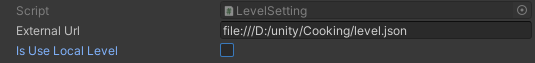
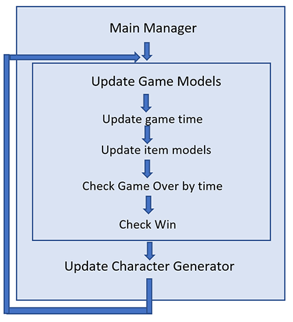

# Разработка приложение Cooking


## UI элементы

* Индикатор, который показывает сколько прошло времени
* Прогресс, в котором отображено сколько пришло посетителей

## Игровые элементы - товар(еда)

* Первая механика. После нажатия, в определенном месте, появляется элемент. Пример:  мясо, сосиска


* Вторая механика. При нажатии элемент переходит в следующее состояние и в конце передается следующему элементу. Пример: стакан с напитком, картошка фри.


* Третья механика. Необходимо собрать элемент из нескольких частей после чего его можно передавать. Пример бургер, hot-dog.


Благодаря данным механикам и их различным комбинациям можно собрать любой товар без лишнего кода.


Персонаж содержит индикатор, который показывает, сколько он готов еще ждать и какую еду он хочет получить.

## Игра заканчивается 

* Выигрышем, если успели обслужить всех персонажей.
* Проигрышем, если у персонажа кончилось терпение или закончилось общее время 

## Настройка параметров еды 

Используется конфигурация GameSettingsInstaller для указания тайминга.


## Настройки уровня 

Используется конфигурация LevelSetting
Указав externalUrl при выключенном параметром UseLocalLevel будет загружаться сторонняя конфигурация уровня. (необходимо учитывать, что пока не загрузится json игра не начнется)



Если есть необходимость протестировать локальную конфигурацию, то можно воспользоваться
генерацией уровня или составить сценарий с четким набором персонажей.
Для активации генерации необходимо указать isGenerateLevel и параметры characterAmount, glassAmount,..


Для сценария с четкой последовательностью необходимо указать каждого персонажа с указанием времени, типа персонажа, содержимое инвентаря и позиции.


За появление персонажей отвечает  CharacterGenerator по мере достижения времени появления пробует поставить персонажа на указанную позицию, если это не удалось  выбирает случайную, если и это не удалось пробует сделать тоже самое на следующей итерации.  

## Основные классы проекта

* MainManager – Основной класс который отвечает за старт игры.
* CharacterGenerator – Отвечает за появления персонажей в игре.
* MainController – Отвечает за основную бизнес логику gameplay.
* LevelSetting – Содержит локальную конфигурацию уровня. Позволяет быстро проверить конфигурацию уровня.
* GameModel – Модель игрового процесса. Содержит все данные игры.  
* Handler – Обрабатывает действие игрока. Определяет объект и субъект и их взаимодействие.  

## Sequence diagram

Диаграмма отображает взаимодействие классов, когда пользователь нажимает на hit zone. В зависимости от конфигурации и текущего состояния игры может выполнятся различное действие.

* Create – создание нового товара
* Next – переход в новое состояние
* External – воздействие на сторонний элемент
* Apply – Добавление товара в уже существующий


## Game Loop



## Json Level Config

```
{
	
	"idZone":0,
    "levelTime":300,
    "characterPlaceAmount":4,
    "glassPlaceAmount":3,
    "meatPlaceAmount":3,
    "burgerPlaceAmount":3,
    "hotdogPlaceAmount":3,
    "sausagePlaceAmount":3,
    "frenchFriesPlaceAmount":3,
    
    "isGenerateLevel":true,
    "generationConfiguration":{
		"characterAmount":10,
    
		"glassAmount":100,
		"burgerAmount":50,
		"hotdogAmount": 50,
		"frenchFriesAmount":70
	},
	
	
	
    "characterConfigs":{}
}
```